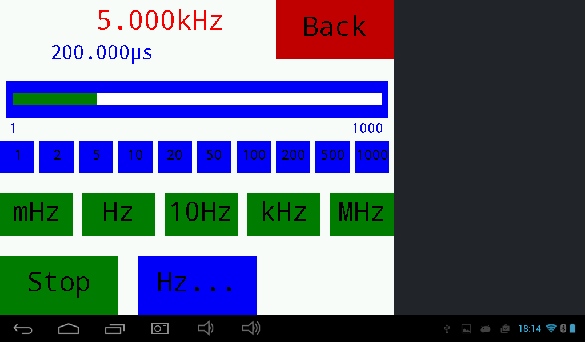

# BlueDisplay
Use your Smatphone as display and input deve for your Arduino or ARM projects.

##SUMMARY
Let the Arduino sketch create a GUI with Graphics, Buttons and Sliders on your smartphone.
GUI callback, touch and sensor events are sent back to Arduino.
No Android programming needed!

## Features
- Graphic + text output as well as printf implementation.
- Draw chart from byte or short values. Enables clearing of last drawn chart.
- Play system tones.
- Touch button + slider objects with tone feedback.
- Button and slider callback as well as touch and sensor events are sent back to Arduino.
- Automatic scaling of display region.
- Easy mapping of UTF-8 characters like Ohm, Celsius etc..
- Up to 115200 Baud using HC-05 modules.
- Local display of received and sent commands for debug purposes.
- C++ Libraries for Arduino and ARM (STM)
